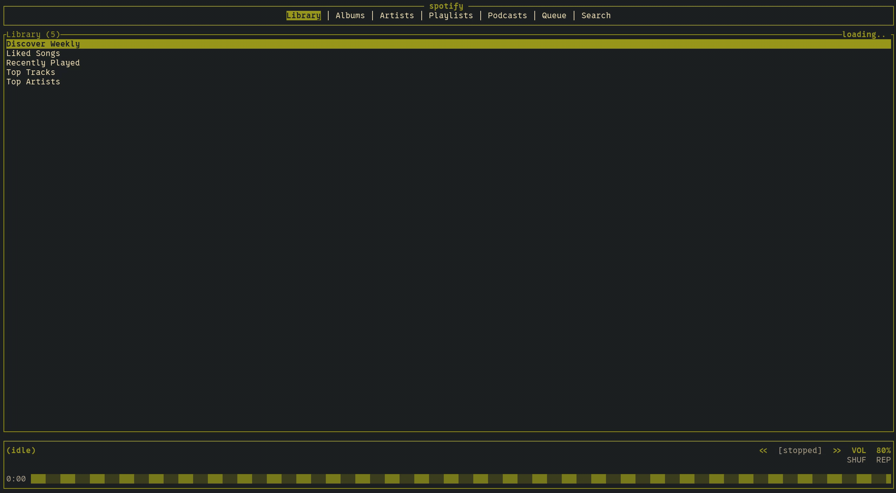

```text
░█▀▀░█░█░█▀▀░█▀█
░█▀▀░█░█░█░█░█▀█
░▀░░░▀▀▀░▀▀▀░▀░▀
```

[](LICENSE)
[](https://doc.rust-lang.org/edition-guide/rust-2024/)
[](#)
[](CHANGELOG.md)

Terminal-native music library aggregator. One TUI, one queue, many sources:
local files (via MPD), internet radio, SomaFM, Spotify, YouTube. Inline
album-art thumbnails on every row when run in a Kitty-graphics-capable
terminal.



## Features

- Inline album-art thumbs on every list row (Kitty Unicode placeholders, with
  a halfblocks fallback for non-Kitty terminals)
- Five sources, one unified queue: local files (MPD), Spotify, YouTube,
  SomaFM, and user-defined internet radio
- Synced lyrics pane (`B`) — timestamped lyrics scroll with playback for
  local, Spotify, and YouTube tracks via the free lrclib.net API; local
  files with embedded lyric tags use those instead of the network
- Vim-style keybinds, mouse support, MPRIS bridge, lifecycle hooks, and a
  unix-socket IPC control plane (`fuga play <uri>`, `fuga next`, …)
- Source-plugin trait — adding a new backend is one file implementing
  `MusicSource`
- Embedded `librespot` for Spotify (no `spotifyd` subprocess) and `yt-dlp`
  shell-out for YouTube (fuga itself never talks to Google)
- Per-source theme palette and a per-source tab bar — `t` cycles the
  active source and the tab list flips with it; each mode is
  user-customizable via `[ui.tabs]`
- See [docs/architecture.md](docs/architecture.md) for the source-plugin
  design and audio-routing notes

---

## Status

v0.3.0 — Local, radio, SomaFM, Spotify, and YouTube all work end-to-end
(browse, play, queue, search, control). Synced lyrics (`B`) for local,
Spotify, and YouTube tracks. Remote sources stream rows into the view as
each page arrives. macOS media keys + Now Playing widget are wired
through `MPRemoteCommandCenter`. See
[CHANGELOG.md](CHANGELOG.md) for the full list.

## Requirements

- Linux or macOS (developed on Void Linux; also builds and runs on macOS)
- Rust 1.75+ to build
- `mpd` running on `localhost:6600` with your library indexed
- A Kitty-graphics-capable terminal for inline thumbs:
  - `kitty`, `ghostty`, `wezterm`, `konsole` (recent), or
  - `st` patched with [kitty-graphics-protocol](https://github.com/sergei-grechanik/st-graphics)
  - Anything else falls back to `halfblocks` (low-resolution but renders)
  - Sixel terminals (`xterm -ti vt340`, `mlterm`, `foot`) supported via
    `thumb_mode = "sixel"` for now-playing art only — row thumbs are
    disabled because sixel cells don't anchor to scrolling rows.
    **WIP:** sixel image overflows one row above its panel border in xterm;
    use kitty mode where possible.
- Spotify Premium + a developer app (`client_id`) — only if you want Spotify

## Install

**Homebrew (macOS, Linuxbrew):**

```sh
brew install crodorg/fuga/fuga
```

The tap formula builds from source via `cargo` and pins to the latest
tagged release. Runtime extras — `brew install mpd yt-dlp` — are opt-in
depending on which sources you want.

**From source:**

```sh
cargo build --release
install -Dm755 target/release/fuga ~/.local/bin/fuga
```

Or use the install script: `./scripts/install.sh`.

## Configure

```sh
mkdir -p ~/.config/fuga
cp examples/config.toml ~/.config/fuga/config.toml
$EDITOR ~/.config/fuga/config.toml
```

Defaults work for local-only use as long as MPD is on `localhost:6600`.

**Path resolution:** fuga checks `$XDG_CONFIG_HOME/fuga` first, then
`~/.config/fuga` if it already exists, otherwise the platform default
(`~/.config/fuga` on Linux, `~/Library/Application Support/fuga` on
macOS). The same order applies to cache and data dirs with
`$XDG_CACHE_HOME` and `$XDG_DATA_HOME`. macOS users who prefer the
XDG layout just need to create `~/.config/fuga/` before first run.

### Tab bar

The top tab bar swaps **per source**. `t` cycles the active source and
the tab list flips to that source's layout. Each mode ships a sensible
default; override any of them via `[ui.tabs]`:

```toml
[ui]
tab_alignment = "center"          # center | left | right
radio_split   = false             # true → separate Radio + SomaFM tabs

# Keep [ui.tabs] as the LAST block under [ui] — it's a TOML sub-table,
# so any flat [ui] keys placed below it would be parsed into it.
[ui.tabs]
local   = ["directories", "albums", "playlists", "queue", "search"]
spotify = ["spotify", "albums", "artists", "playlists", "podcasts", "queue", "search"]
youtube = ["youtube", "queue", "search"]
radio   = ["stations", "queue"]
somafm  = ["stations", "queue"]
```

Recognized tab ids: `queue`, `directories`, `albums`, `artists`,
`playlists`, `stations`, `radio`, `somafm`, `spotify`, `podcasts`,
`youtube`, `search`. Sources omitted from `[ui.tabs]` (or with empty /
all-invalid lists) use the hard-coded default, so you can't lock
yourself out of navigation.

### Now-playing art panel

The bottom-right art panel resizes via two percentage knobs. Vertical
100% sits flush under the tab bar; horizontal 100% runs from the
24-cell text margin to the right edge. Aspect is preserved — whichever
axis hits its limit first constrains the other.

```toml
[ui]
art_height_pct = 70   # clamped to [20, 100]
art_width_pct  = 40   # clamped to [15, 100]
# art_collapsed = false   # start with the panel shrunk into the bottom bar
```

### Spotify setup

Quick version:

1. Create an app at <https://developer.spotify.com/dashboard>. Add
   `http://127.0.0.1:8888/callback` to the app's redirect URIs.
2. Set `[spotify] enabled = true` and `client_id = "..."` in your config.
3. Run `fuga --spotify-auth` once. A browser opens; approve. Token persists
   at `~/.local/share/fuga/spotify_tokens.json` (mode 0600).
4. Run `fuga` normally.

Stuck? `cat docs/spotify-setup.md` (or read it on
[GitHub](https://github.com/crodorg/fuga/blob/main/docs/spotify-setup.md)) —
full walkthrough with troubleshooting + every scope explained.

If Spotify and MPD compete for the same ALSA device, route both through
PulseAudio or PipeWire (both expose a `pulse` device that mixes for you).

## Keys (defaults)

| Key                  | Action                                         |
|----------------------|------------------------------------------------|
| `q`                  | Quit                                           |
| `j` / `k`            | Down / up                                      |
| `C-d` / `C-u`        | Page down / up                                 |
| `g g`                | Top                                            |
| `G`                  | Bottom                                         |
| `Tab` / `S-Tab`      | Cycle tabs                                     |
| `C-n` / `C-p`        | Cycle tabs (alt)                               |
| `1`–`9`              | Jump to tab N                                  |
| `Enter` / `l`        | Activate (descend / play)                      |
| `a`                  | Enqueue (add to queue without playing)         |
| `Esc` / `h`          | Back one level                                 |
| `Space`              | Play / pause                                   |
| `n` / `p`            | Next / previous track                          |
| `H` / `L`            | Seek -10s / +10s                               |
| `S`                  | Stop                                           |
| `+` / `-`            | Volume up / down                               |
| `z`                  | Toggle shuffle                                 |
| `x`                  | Cycle repeat (off → all → track)               |
| `o`                  | Sort modal                                     |
| `d`                  | Spotify Connect device picker                  |
| `T`                  | Cycle thumbnail mode                           |
| `t`                  | Cycle active source (Local → Spotify → …)      |
| `r`                  | Refresh current view                           |
| `s`                  | Focus search input                             |
| `/`                  | Filter rows in current page                    |
| `:`                  | Focus command bar                              |
| `?`                  | Toggle help overlay                            |
| `F`                  | Like / unlike current track (Spotify)          |
| `f`                  | Follow playing track (jump cursor to it)       |
| `C`                  | Clear queue                                    |
| `D`                  | Remove hovered row from queue                  |
| `m`                  | Open contextual action menu                    |
| `P`                  | Pin / unpin hovered item                       |
| `v`                  | Expand hovered album art                       |
| `B`                  | Toggle synced-lyrics view                      |
| `Y`                  | Download hovered track (YouTube)               |

Plus leader chords: `g g` (top) and `g {l,s,r,f,y}` to jump to Local /
Spotify / Radio / SomaFM / YouTube. All keys are user-configurable —
the example config lists every default explicitly with grouped
comments.

**Mouse**:
- Click a tab label → switch tab
- Click a row → play / descend
- Scroll wheel anywhere → cursor up/down
- Scroll wheel over the volume cell → volume up/down
- Click on the progress bar → seek to that fraction
- Right-click on the progress bar → pause/resume
- Album-art panel swallows clicks (rows behind it don't fire)

## Command bar

Type `:` then:

| Command       | Effect                                             |
|---------------|----------------------------------------------------|
| `:q` / `:quit`| Quit                                               |
| `:add <uri>`  | Append `<uri>` to the queue (scheme picks source)  |
| `:play <uri>` | Push `<uri>`, play immediately                     |
| `:goto <n>`   | Jump to queue index `n`                            |
| `:vol <0..100>`| Set master volume                                 |

URI scheme determines the source: `local:`, `radio:`, `somafm:`, `spotify:`,
`youtube:`.

## CLI subcommands

A running fuga listens on a unix socket (`$XDG_RUNTIME_DIR/fuga.sock`).
From another shell:

```sh
fuga play spotify:track:11dFghVXANMlKmJXsNCbNl
fuga next
fuga prev
fuga pause
fuga stop
fuga vol 60
fuga status
```

`fuga status` prints `title | artist | mm:ss/mm:ss | source` so it composes
into status bars and waybar modules.

## MPRIS

Linux media keys and system mixers (KDE Plasma, GNOME, `playerctl`) drive
fuga via the MPRIS D-Bus bridge automatically — no setup. Volume changes
from outside fuga (e.g. KDE's mixer) sync back to the bottom bar.

## Hooks

Set shell commands in `[hooks]` to run on lifecycle events. They receive
state via `FUGA_*` env vars:

```toml
[hooks]
on_track_change  = "notify-send 'Now playing' \"$FUGA_TITLE — $FUGA_ARTIST\""
on_source_switch = "logger fuga: $FUGA_SOURCE_FROM -> $FUGA_SOURCE_TO"
on_startup       = "echo started >> ~/.cache/fuga/runs.log"
```

## Search

Press `/`, type, Enter. Query fans out across every registered source in
parallel; results are grouped by source. `j`/`k` to navigate, Enter to play.

## Troubleshooting

- **No audio after switching to Spotify** — check `~/.cache/fuga/fuga.log`
  for `librespot stop timed out`. If MPD and librespot share `default` ALSA
  device they fight; use PulseAudio/PipeWire or different ALSA devices in
  `mpd.conf` / your PA config.
- **Inline thumbs invisible** — your terminal probably isn't Kitty-capable.
  Press `T` to cycle to halfblocks (works anywhere). Verify your terminal
  with: `printf '\e_Gi=31337,s=1,v=1,a=q,t=d,f=24;AAAA\e\\'`.
- **Under tmux** — set `set -g allow-passthrough on` in `tmux.conf` and use
  tmux ≥ 3.4. Otherwise the graphics protocol is silently dropped.
- **Spotify auth fails** — delete `~/.local/share/fuga/spotify_tokens.json`
  and re-run `fuga --spotify-auth`. Confirm the redirect URI in your Spotify
  developer dashboard matches `redirect_port` in your config.
- **MPD connection error on startup** — `mpc status` to verify MPD is
  running, then `mpc update` to make sure it sees your library.
- **Phone doesn't see fuga as a Spotify Connect device** — you need a
  `client_id` configured (Spotify Web API only registers Connect devices
  through an authenticated session). Re-run `fuga --spotify-auth` if it's
  been a while since the token was issued.

## Logs

`~/.cache/fuga/fuga.log`. `fuga --debug` raises log level. The TUI never
writes to stdout (would corrupt the screen).

## Development

```sh
cargo run -- --debug              # dev
cargo test                        # unit tests
cargo clippy -- -D warnings       # lint
cargo fmt                         # format
```

See [docs/architecture.md](docs/architecture.md) for architecture, the
source-plugin trait, audio routing notes, and the phased roadmap.

## License

MIT. See [`LICENSE`](LICENSE).

## Legal / acknowledgments

**Authorship.** fuga is a hobby project. Large parts of the code were
written with AI assistance, reviewed and integrated by the author. Bug
reports and pull requests are welcome; clean rewrites of any module are
welcome too.

**Spotify.** fuga uses [librespot](https://github.com/librespot-org/librespot)
to stream from Spotify. librespot is an open-source project not approved
or endorsed by Spotify; using it outside personal/educational contexts
may violate the
[Spotify Terms of Service](https://www.spotify.com/legal/end-user-agreement/).
A Spotify Premium account is required. fuga is intended for personal use
and is not affiliated with Spotify AB.

**YouTube.** fuga shells out to a separately-installed
[`yt-dlp`](https://github.com/yt-dlp/yt-dlp) binary to search, stream, and
optionally download tracks from YouTube. fuga itself sends no traffic to
Google/YouTube; it only invokes the local `yt-dlp` binary. Users are
responsible for compliance with the
[YouTube Terms of Service](https://www.youtube.com/static?template=terms),
including any rules around downloading audio. Downloaded files land in
`[youtube] download_dir` if you set one, otherwise MPD's
`music_directory`, otherwise XDG Downloads / `~/Downloads`. fuga is not
affiliated with Google LLC or YouTube.
